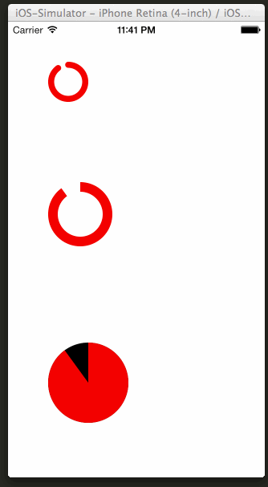

TiCircularProgress
===========================================

Circular progress indicator module for Appcelerator Titanium.

### Usage

TiCircularProgress is pretty much a ProgressView replacement.

	var TiCircularProgress = require('de.marcelpociot.circularprogress');

	var progressView = TiCircularProgress.createProgressView({
		top: 50,
		left: 50,
		height: 50,
		width: 50,
		roundedCorners: true,
		progress: 0,
		progressTintColor: 'red',
		trackTintColor: 'transparent',
		animatedProgress: true
	});
	win.add( progressView );
	

### Options

#### roundedCorners

Type: `BOOL`  
Default: `FALSE`

Use rounded corners for the progress indicator.

#### progress

Type: `Float`  
Default: `0.0`

Progress to display (0.0 - 1.0).

#### progressTintColor

Type: `Color`  
Default: `none`

Color indicating the progress.

#### trackTintColor

Type: `Color`  
Default: `none`

Color indicating the progress left.

#### animatedProgress

Type `BOOL`
Default: `FALSE`

Animate the progress updates.

#### thicknessRatio 

Type: `Float`
Default: `0.3`

Defines the thickness of the progress indicator and determines the space available on the inside.
If `thicknessRatio` is `1.0` the indicator is displayed as a full circle.

ABOUT THE AUTHOR
========================
I'm a web enthusiast located in Germany.

Follow me on twitter: @marcelpociot

